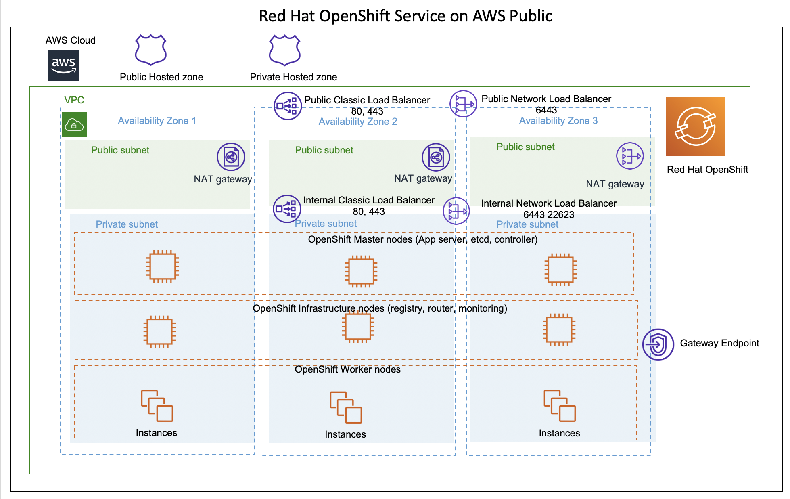
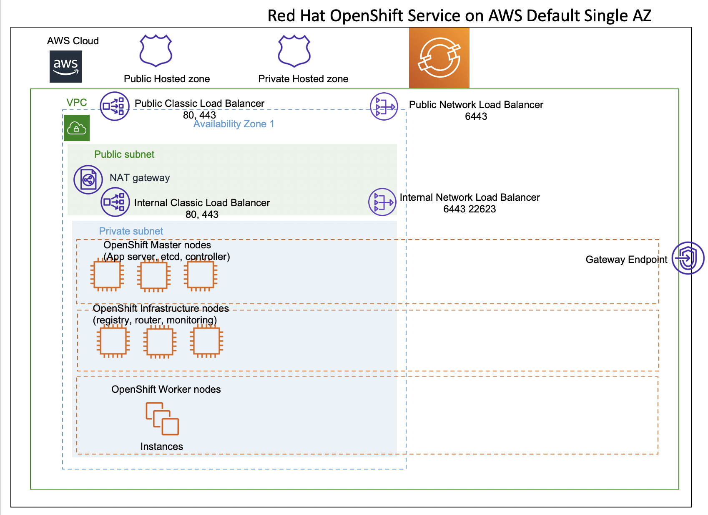
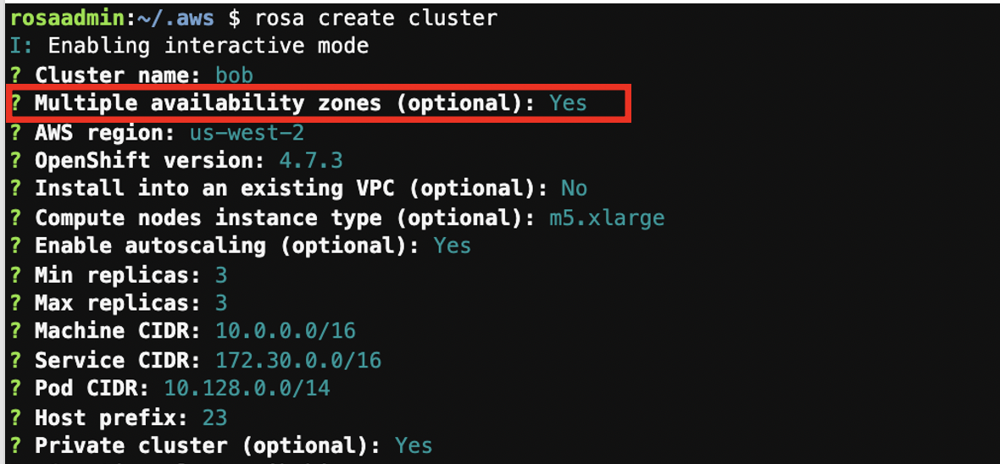
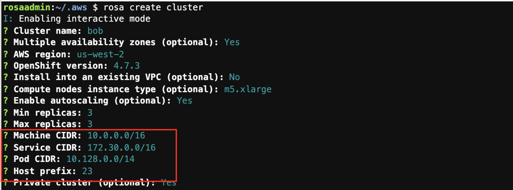
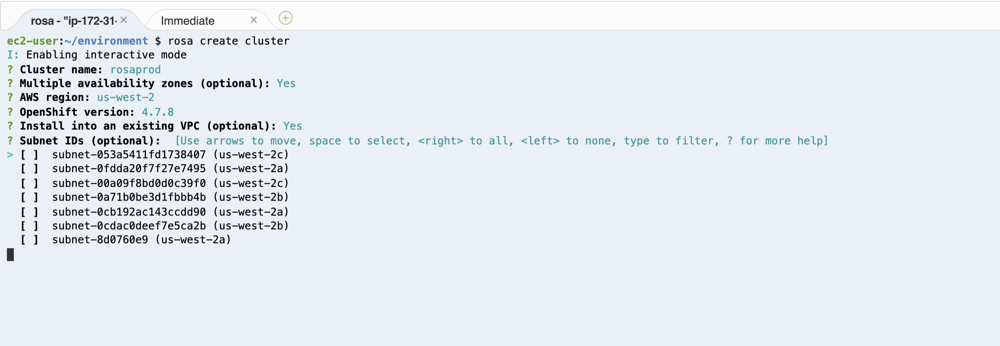
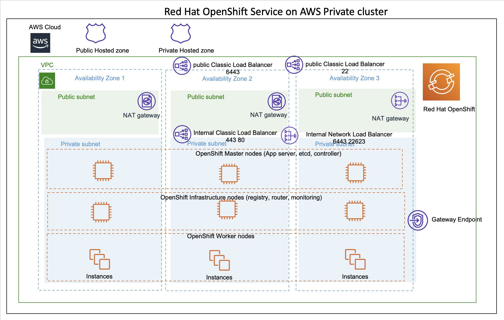

# ROSA
Redhat Openshift Service on AWS

---


## ROSA Architecture




## Default deployment (Single AZ)

```bash
rosa create cluster <cluster name>
```



 - Subnet 2 : Public 1 EA, Private 1 EA
 - Master, Infrastructure, Worker in same subnet(private) 
 - Mater Node : 3 EA
 - Infra Node(router, registry) : At least 2 EA
 - Not Production

## Multi-AZ cluster 
```bash
rosa create cluster
or
rosa create cluster -- interactive
or
rosa create cluster --cluster-name testcluster --multi-az --region us-west-2 --version 4.7.3 --enable-autoscaling --min-replicas 3 --max-replicas 3 --compute-machine-type m5.xlarge --machine-cidr 10.0.0.0/16 --service-cidr 172.30.0.0/16 --pod-cidr 10.128.0.0/24 --host-prefix 23

```



 - 3 Available Zones
 - 각 AZ 별 Public 과 private subnet (총 6 subnets)
 - existing VPC를 지정하지 않으면 VPC 생성
 - Master 3 EA, Infra 3 EA (각 AZ당 1개)

#### Subnet sizing and address spaces
  

**1. Machine CIDR 10.0.0.0/16**  
AWS VPC의 IP Address 영역으로, 기존에 존재하는 VPC를 사용하는 경우 그 VPC CIDR을 반영해야 한다.  
새롭게 구성이 되면 동일한 크기의 6개의 서브넷으로 구성된다.   
명심해야 할 것은 **public subnet에 많은 리소스가 필요하지는 않기 때문에 크게 잡을 필요는 없다.** (주로 load balancer와 NAT gateway interface)

**Service CIDR and POD CIDR**
OpenShift가 사용한 SDN private IP address 영역이다. 


https://example-wgordon.apps.osd4-demo.u6k6.p1.openshiftapps.com/

### 기본 VPC를 사용하는 경우 subnet 선택 가능



## Public Cluster vs Private Cluster


### Public Cluster


### Private Cluster


Default deployment (Single AZ)


Private Cluster vs Public Cluster의 차이점은 생성할때, workload가 사용할 public facing loadbalancer를 생성할것 인가 아닌가의 차이이다. 


## Connection Flow
1. Customer/application consumer connection flow

Customer의 연결은 80 또는 443 연결

**외부에서 들어오는 요청**
 - 외부에서 들어오는 요청은 **public Classic Load Balancer**가 받아서, Infrasture node에 있는 Openshift router layer로 forward 한다.
**내부에서 오는 요청**
 - VPC 내부, AWS DirectConnect, Peering, VPN, TransitGW 에 오는 경우는 **internal Classic Load Balancer**가 받아서, Infrasture node에 있는 Openshift router layer로 forward 한다. 

2. Administrative or SRE connection flow
Developers, administrators, SRE teams 은 다음 flow를 따른다. 

**외부에서 들어오는 요청**

 - 외부에서 들어오는 요청은 **Network Load Balancer over 6443** 가 받아서, Openshift API, OpenShift Web Console 로 연결한다. 
 - DevOps Solution(Pipeline, build, deploy)도 동일한 flow

**내부에서 오는 요청**
- VPC 내부, AWS DirectConnect, Peering, VPN, TransitGW 에 오는 경우는 Internal Network Load Balancer와 연결되며, Openshif Master node의 API endpoint로 forward 된다. 


Load balancer for AWS service
ROSA의 workload와 다른 AWS account나 VPC와 연결하기 위해서는 PrivateLink를 사용하며, CLB를 NLB로 교체해야 하며, 현재 ROSA CLI가 지원하지 않기 때문에 manual로 NLB를 만들고 OpenShift cluster의 egress를 변경해 줘야 한다. 

마찬가지로 AWS WAF를 이용하고 싶으면, CLB 앞에 ALB를 두고 target을 AWS WAF로 구성한다. 

참조 
https://aws.amazon.com/blogs/containers/red-hat-openshift-service-on-aws-architecture-and-networking/
https://openshift4-on-aws.awsworkshop.io/4-rosa-track/3-rosa-architecture/1_rosa-arch.html


