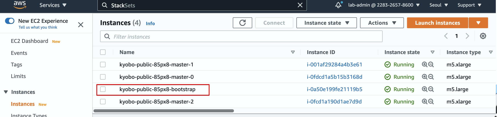
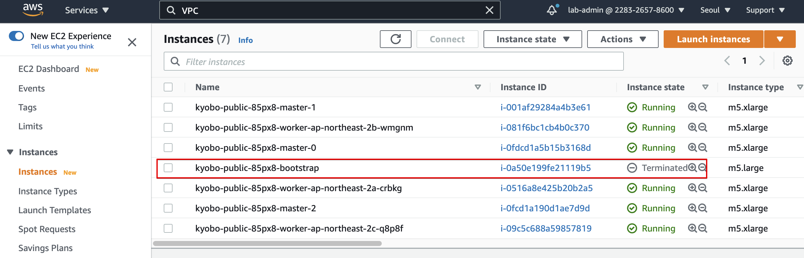

# Setting up cluster and accounts
 [Redhat 공식 문서](https://docs.openshift.com/rosa/rosa_getting_started/rosa-getting-started-workflow.html)를 참조한다. 


실제 작업은 [ROSA Workshop 자료](https://openshift4-on-aws.awsworkshop.io/4-rosa-track/2-deploying-rosa/1-prerequisites/1_rosa-prerequisites.html)를 참조 한다.
## Prerequisites 
### summary
 - Minimun SCP
 - Red Hat managed IAM references for AWS : Redhat login 계정 필요
 - Service Quota


### Step 1 Review the prerequisites documentation
 -  https://docs.openshift.com/rosa/rosa_getting_started/rosa-aws-prereqs.html

 - https://docs.openshift.com/rosa/rosa_getting_started/rosa-creating-cluster.html

### Step 2 - AWS Config 
AWS CLI, AWS Credential Config

### Step 3 - install ROSA CLI, SetUp

참조 : https://docs.openshift.com/rosa/rosa_getting_started/rosa-setting-up-environment.html

1. Download the [latest release](https://access.redhat.com/products/red-hat-openshift-service-aws/) of the rosa CLI for your operating system.

```bash
wget https://github.com/openshift/rosa/releases/download/v1.0.2/rosa-linux-amd64
chmod 755 rosa-linux-amd64
sudo mv rosa-linux-amd64 /usr/local/bin/rosa
```

2. download and install oc
```
rosa download oc
ls
tar zxvf openshiftxxxx
chmod 755 oc
sudo mv oc /usr/local/bin/
```

3. enable ROSA  


4. ROSA init
```bash
rosa init

```


### Step 4 - Create Cluster
```bash
rosa create cluster --interactive
```


#### Example
```bash
rosa create cluster --interactive
I: Interactive mode enabled.
Any optional fields can be left empty and a default will be selected.
? Cluster name: kyobo-public
? Multiple availability zones (optional): Yes
? AWS region: ap-northeast-2
? OpenShift version: 4.7.13
? Install into an existing VPC (optional): No
? Compute nodes instance type (optional): 
? Enable autoscaling (optional): Yes
? Min replicas: 3
? Max replicas: 3
? Machine CIDR: 10.0.0.0/16
? Service CIDR: 172.30.0.0/16
? Pod CIDR: 10.128.0.0/14
? Host prefix: 23
? Private cluster (optional): No
I: Creating cluster 'kyobo-public'
I: To create this cluster again in the future, you can run:
   rosa create cluster --cluster-name kyobo-public --multi-az --region ap-northeast-2 --version 4.7.13 --enable-autoscaling --min-replicas 3 --max-replicas 3 --machine-cidr 10.0.0.0/16 --service-cidr 172.30.0.0/16 --pod-cidr 10.128.0.0/14 --host-prefix 23
```

#### Install 진행사항 보기 
```bash
rosa logs install -c kyobo-public --watch
```

> 약 40분 소요

#### Install 완료 후
```bash
rosa list clusters

## describe cluster

rosa describe cluster -c <cluster-name>
```

#### Accessing ROSA Cluster
https://docs.openshift.com/rosa/rosa_getting_started/rosa-accessing-cluster.html#rosa-accessing-cluster

```bash
rosa create admin --cluster=<cluster_name>

rosa create admin --cluster=kyobo-public
W: It is recommended to add an identity provider to login to this cluster. See 'rosa create idp --help' for more information.
I: Admin account has been added to cluster 'kyobo-public'.
I: Please securely store this generated password. If you lose this password you can delete and recreate the cluster admin user.
I: To login, run the following command:

   oc login https://api.kyobo-public.76tq.p1.openshiftapps.com:6443 --username cluster-admin --password IjIk8-Htkus-XXXXXX

I: It may take up to a minute for the account to become active.
```

#### Login Console with username and pwd
위에 제공된 패스워드로 접속


## Deploy sample App
``` bash
oc apply -f nginx.yaml 

oc get pods

oc get svc sample-service
```


---
#### Install Notes - 2021.06.11
 - CloudFormation이 아니고, Terraform module으로 만든다. 
   - `rosa logs install -c kyobo-public --watch` 로 보면 만들고 있는 resouce를 추적할 수 있다. 
   ```bash
   time="2021-06-10T22:20:09Z" level=debug msg="module.masters.aws_network_interface.master[2]: Creating..."
   time="2021-06-10T22:20:11Z" level=debug msg="module.vpc.aws_security_group_rule.worker_ingress_services_tcp: Creation complete after 14s [id=sgrule-2711114762]"
    ```
 - 초기에 bootstrap이라는 EC2 Instance가 만들어 졌다가, Terminate 된다.
  
  

 1. VPC
 2. Master Node
 3. NLB

 time="2021-06-10T22:25:32Z" level=info msg="Waiting up to 30m0s for bootstrapping to complete..." 
  - 이때 시간이 만이 걸리고, master node가 NLB의 Target group에 unhealthy로 나오는건(6443 port), Master Node 설치중으로 보인다. 

 time="2021-06-10T22:40:38Z" level=debug msg="Still waiting for the cluster to initialize: Working towards 4.7.13: 634 of 669 done (94% complete)"
 - Worker Node healthy로 변경


만들어지는 순서
VPC


참조 : 

 - [Creating a ROSA Cluster from RedHat](https://docs.openshift.com/rosa/rosa_getting_started/rosa-creating-cluster.html) 
 - CIDR 계산 App: https://example-wgordon.apps.osd4-demo.u6k6.p1.openshiftapps.com/
 - AWS Blog : https://aws.amazon.com/blogs/containers/red-hat-openshift-service-on-aws-architecture-and-networking/
 - Delete ROSA : https://docs.openshift.com/rosa/rosa_getting_started/rosa-deleting-cluster.html

```bash
rosa

rosa completion > /etc/bash_completion.d/rosa

source /etc/bash_completion.d/rosa

## verify AWS account permission
rosa verify permissions

## Red Hat account login
rosa login

rosa verify quota --region=ap-northeast-2

rosa whoami

rosa init

```